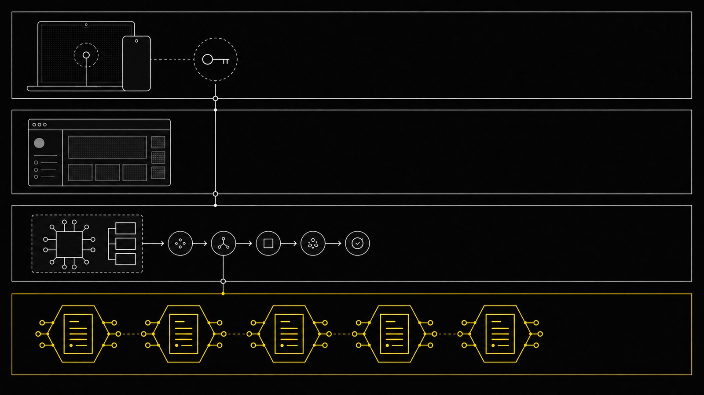

**[🇬🇧 English](README.md) · [🇻🇳 Tiếng Việt](README.vi.md) · [🇨🇳 中文](README.zh.md)**

<div align="center">


# FamilyHaven

**A Stellar smart wallet with no seed phrase — your family is the recovery mechanism.**

*Other wallets hand you twelve words to lose. This one hands you your family.*

Stellar APAC Hackathon 2026


**[🌐 Landing](https://familyhavenwallet.mscilabs.com/)** · **[↗ Live app](https://familyhaven.mscilabs.com)** · **[▶ Trailer](https://www.youtube.com/watch?v=K5jz1tClGng)** · **[⚡ Quick start](#quick-start)**


Welcome, Stellar judges — the links above lead to the public story, the real Testnet application, and the two-minute product trailer.

</div>

## Judge in 60 seconds

| | |
|---|---|
| **Problem** | Seed phrases turn wallet recovery into a single fragile secret. Losing it can lock out the owner; sharing it can give away the wallet. |
| **Solution** | A passkey-backed Stellar smart account keeps the signing key in the device Secure Enclave or TPM. Three or more chosen family guardians provide a threshold recovery path with a 24-hour timelock and owner veto. |
| **Result** | The owner can use and recover a real Testnet smart wallet without storing or typing twelve words. A direct chain watcher can alert them outside the application if recovery starts. |
| **Control** | Minimum guardian, threshold, timelock, rotation cooldown, and spending-cap rules are enforced on-chain. Publicly rebuilt contract hashes are independently visible on StellarExpert. |

## The 2-minute demo

1. Open the [live app](https://familyhaven.mscilabs.com), create an account, and register a device passkey. No seed phrase is generated.
2. Add family guardians. The invitation page explains the role and risk before sign-in; recovery becomes active only after at least three guardian keys are on-chain.
3. Send XLM on Stellar Testnet. Everyday transfers follow user-configured soft limits; the policy contract measures spend and enforces the hard cap.
4. Start recovery from another device. Guardians approve, the 24-hour veto window remains visible, and a separate chain watcher can send an email even if the application indexer is unavailable.
5. Finalization rotates the smart-account signer. The former key stops working and a 300-second cooldown blocks immediate post-rotation racing.

This repository has **no canned demo mode**. Product flows use real Stellar Testnet contracts and transactions.

## Why it is technically different

| Capability | What it prevents |
|---|---|
| No seed phrase — passkey in Secure Enclave or TPM | Losing paper or entering twelve words into a phishing site |
| Minimum recovery constraints enforced **inside the contract** | A compromised server lowering recovery to one guardian or a zero-hour wait |
| **Two independent alert paths** — one process reads the contract directly and sends email outside the app | Silencing the owner by disabling only the indexer for 24 hours |
| 24-hour timelock plus on-chain owner veto | Colluding guardians taking the wallet immediately |
| Spending limit as a **policy contract** attached to OpenZeppelin authorization rules | A compromised server draining the wallet |
| Limit increases wait 24 hours | An account attacker raising the cap and withdrawing immediately |
| No “publisher guardian” | The application publisher recovering a user's wallet |
| 300-second cooldown after signer rotation | Racing a transaction immediately after the key changes |
| Append-only audit trail with role-level revocation | An administrator deleting evidence |
| Invitation page explains the role **before sign-in** | The product itself teaching users phishing habits |

### On-chain recovery invariants

These constraints were moved from server-side checks into the contracts during self-review, so control of the server cannot lower them:

| Invariant | Enforced value | Contract result |
|---|---:|---|
| `MIN_GUARDIANS` | `3` | panic `#4` on violation |
| `MIN_THRESHOLD` | `2` | panic `#3` on violation |
| `MIN_TIMELOCK_SECS` | `86,400` | panic `#17` on violation |
| Post-rotation cooldown | `300s` | code `#101` while active |

### Spending policy

| Layer | Default shown in the product | Change control |
|---|---:|---|
| Per transfer, soft and user-configurable | `1,000 XLM` | A decrease applies immediately |
| Rolling 24 hours, soft and user-configurable | `10,000 XLM` | An increase waits 24 hours, emails the owner, and is cancellable |
| Hard on-chain ceiling | `20,000 XLM` | Cannot be exceeded by the server |

## Architecture



```text
Family member (browser, no app install)
      │
 Passkey ── Secure Enclave / TPM · key never leaves device
      │
 SEP-45 wallet session ── separate from app session
      │
┌─────────────────────────── ON CHAIN (source of truth) ───────────────────────────┐
│  smart-account (OZ stellar-accounts)                                             │
│    __check_auth ── rotate cooldown → context rules → policy.enforce()            │
│         ├── rule 0 (default)  + spending-limit policy                            │
│         └── rule 1 (owner)    + spending-limit policy                            │
│  recovery-registry ── MIN_GUARDIANS 3 · THRESHOLD 2 · TIMELOCK 24h · veto        │
│  origin-verifier ── passkey origin allow-list pinned at deploy                   │
└──────────────────────────────────────────────────────────────────────────────────┘
      │                                        │
 Indexer (Postgres mirror)          recovery-watch ── reads chain DIRECTLY
      │                                        │
 In-app alerts                       Email OUTSIDE the app
                                     (survives our own outage)
```

### Technical stack

| Layer | Components |
|---|---|
| Contracts | Rust · Soroban SDK 26.1.1 · OpenZeppelin `stellar-accounts =0.7.2` · `wasm32v1-none` · stellar-cli 27.0.0 · rustc 1.97.1 |
| Backend | Bun · Hono 4.12 · Drizzle · PostgreSQL · Dragonfly · BullMQ · Better Auth 1.6 |
| Frontend | React 19 · Vite · TanStack Router/Query · three locales (`vi`, `en`, `zh`) |
| Deployment | Docker Compose with three pre-flight gates and zero-downtime rollout · Cloudflare Pages |
| Authentication | WebAuthn passkey · SEP-45 wallet session · no seed phrase anywhere in the codebase |

## Evidence, not promises

### Public contract verification

StellarExpert currently reports `validation.status = verified` for all five deployed contracts:

| Contract | Stellar Testnet ID | Status | Verified source |
|---|---|---|---|
| `recovery-registry` | [`CDGB…4JIR`](https://stellar.expert/explorer/testnet/contract/CDGBHEXSPNO4CJHYSSV4FZBN3C7XXQOPZPDATR65SH5QHRCDB2WL4JIR) | **verified** | [`da689235`](https://github.com/msci2049-hkt/vigiadinh/commit/da6892353e8b2076508e866efe9e1d13a7264ed4) |
| `origin-verifier` | [`CBFC…VVGW`](https://stellar.expert/explorer/testnet/contract/CBFCNHIOQN3N5IVSIVW4TTKYXZ73YQI4DZPADC6UCWF2XU35W4GVVWGW) | **verified** | [`da689235`](https://github.com/msci2049-hkt/vigiadinh/commit/da6892353e8b2076508e866efe9e1d13a7264ed4) |
| `web-auth` (SEP-45) | [`CBWM…JBWD`](https://stellar.expert/explorer/testnet/contract/CBWMHVEEXEOSOSWULYNYN62EYVMWJT55NKRPUI2MXSYHVVZ6NIMRJBWD) | **verified** | [`da689235`](https://github.com/msci2049-hkt/vigiadinh/commit/da6892353e8b2076508e866efe9e1d13a7264ed4) |
| `verifier-ed25519` | [`CC7L…VDEE`](https://stellar.expert/explorer/testnet/contract/CC7L7IGJ7ZBUQCYUTV6J6KLKMKYKAZIV5FMRISPNIZZW63664TWOVDEE) | **verified** | [`96957faa`](https://github.com/msci2049-hkt/vigiadinh/commit/96957faa46230744a56f90655b7994ff045c4844) |
| `spending-limit-policy` | [`CCIN…FJZK`](https://stellar.expert/explorer/testnet/contract/CCIN4CP4HAFNDBSS7ZILGKBTUNC2TDAMFCLSI7E2TW44SJ7R7FTSFJZK) | **verified** | [`96957faa`](https://github.com/msci2049-hkt/vigiadinh/commit/96957faa46230744a56f90655b7994ff045c4844) |

Verification means a rebuild from the linked public source matches the on-chain hash. It is **not** an independent security audit.

| Additional deployment identifier | Value |
|---|---|
| Network | **Stellar Testnet** |
| Smart-account WASM | `c1b28d42da1b7b091307c9acb0d72b88f45cc29d404b4d3c30bca0250a9d565f` |
| Fixed native SAC | [`CDLZ…CYSC`](https://stellar.expert/explorer/testnet/contract/CDLZFC3SYJYDZT7K67VZ75HPJVIEUVNIXF47ZG2FB2RMQQVU2HHGCYSC) |

### Reproducible gates and transaction evidence

| Quality gate | Result |
|---|---|
| Publicly verified contracts | **5/5** — three from `da689235`, two from `96957faa` |
| Contract tests (Rust) | **82 pass** |
| Backend tests, current full Windows run | **457 pass**, 22 environment-gated skips; one Bash retention test fails because its temporary path crosses Windows/Bash boundaries |
| Frontend unit tests | **209 pass** |
| On-chain limit — below threshold | Passes **and is recorded in cumulative spend** |
| On-chain limit — one transfer above threshold | Rejected with `#3221` |
| On-chain limit — cumulative transfers exceed threshold | Rejected |
| On-chain limit — after the rolling window | Passes again |
| Rotation of a full **15-key** wallet | Succeeds with ledger evidence |
| 300-second cooldown | Blocks during the window and reopens on the boundary |
| Too few guardians | Rejected with `#4` |
| Recovery alert reading the chain directly | Email sent outside the application with `status=sent` |
| Unreplaced i18n placeholder gate | Present; it catches a regression that previously escaped twice |
| Append-only audit | Two layers: PostgreSQL trigger plus role-level permission revocation |

The badge says “600+ passing” because the latest recorded suites contain **748 passing tests** across contracts, backend, and frontend. Environment-gated Testnet and Dragonfly cases are reported separately rather than counted as passes.

## Quick start

```bash
git clone https://github.com/msci2049-hkt/vigiadinh.git
cd vigiadinh

# Contracts
cd contracts && cargo test --workspace && stellar contract build

# Backend (:3000)
cd ../be && cp .env.example .env
# Fill DATABASE_URL, REDIS_URL, RESEND_API_KEY, and contract IDs.
bun install && bun run validate && bun test

# Frontend (:5173)
cd ../fe && pnpm install && pnpm validate && pnpm test && pnpm dev
```

There is **no scripted demo mode in this source tree**. Runtime flows operate against Stellar Testnet.

## Demo access

| | |
|---|---|
| Landing | [familyhavenwallet.mscilabs.com](https://familyhavenwallet.mscilabs.com/) |
| Live product | [familyhaven.mscilabs.com](https://familyhaven.mscilabs.com) |
| Network | **Stellar Testnet** |
| Demo mode | None — use a Testnet account and real Testnet flows |

## Repository map

```text
contracts/          recovery-registry · origin-verifier · web-auth · verifier-ed25519
                    smart-account · spending-limit-policy
be/                 modules: guardians · recovery · intents · notifications · inheritance
                    jobs: recovery-watch · indexer · presence · heartbeat · sweeper
fe/apps/web/        wallet · guardians · protecting · setup wizard · settings
docs/               VERIFY-CONTRACT.md · AUDIT-TINH-NANG.md · evidence/TESTNET.md
                    INHERITANCE.md · SEND-ADDRESSES.md · THREAT-MODEL.md
```

## Submission links

| | |
|---|---|
| 🌐 Project landing | [FamilyHaven](https://familyhavenwallet.mscilabs.com/) |
| ↗ Live product | [Open the Testnet app](https://familyhaven.mscilabs.com) |
| ▶ Trailer | [Family Haven 4K Introduction](https://www.youtube.com/watch?v=K5jz1tClGng) |
| ⌘ Source | [github.com/msci2049-hkt/vigiadinh](https://github.com/msci2049-hkt/vigiadinh) |
| ✉ Contact | [MSCI Labs](https://www.mscilabs.com) |

## Known limitations

| Limitation | Status |
|---|---|
| Guardian approval is a database record, **not yet an on-chain signature** | A compromised server could forge an approval. Identified internally; remediation is in progress |
| Passkeys are bound to the domain | Losing the domain removes the current signing path. A CLI signing recovery guide is being written |
| **No independent security audit yet** | Required before any mainnet release |
| The interface displays and spends XLM only | The wallet can receive any Stellar asset at protocol level; a spam-token filter is still needed |
| Hospital-care workflows and percentage inheritance | Roadmap items; not implemented |
| Testnet only | Intentional for this prototype; see the scope notice |

## Roadmap

### In-app voice and video checks for high-value transfers

When a transfer exceeds the owner's configured approval threshold, a guardian will be able to start an in-app voice or video call directly from the pending approval request. The request will keep the recipient, amount, and transaction fingerprint beside the call, helping the family verify the owner's intent without switching to Zalo, a separate phone call, or another messaging app.

The call will be an additional coordination layer, **not an authorization factor**. It will not approve, sign, or broadcast a transfer: the deterministic spending policy, guardian approval, and wallet owner's cryptographic signature will remain required. This feature is **planned and not implemented yet**. Signaling, encryption, metadata retention, and abuse controls must be threat-modeled before release. Wallet recovery after every trusted device is lost remains a separate identity-verification problem.

## Team

**[MSCI Labs](https://www.mscilabs.com)** — Vietnam · Singapore · Thailand · India

---

> **Scope.** Hackathon prototype on Stellar Testnet. No real funds. Policy thresholds are illustrative and user-configurable. Contract verification confirms the published source matches on-chain bytecode — it is not an independent security audit. Not financial advice.
