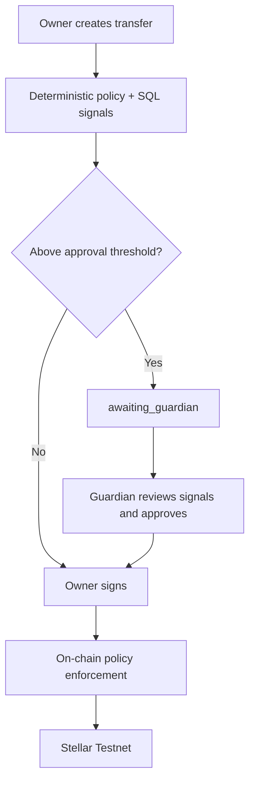
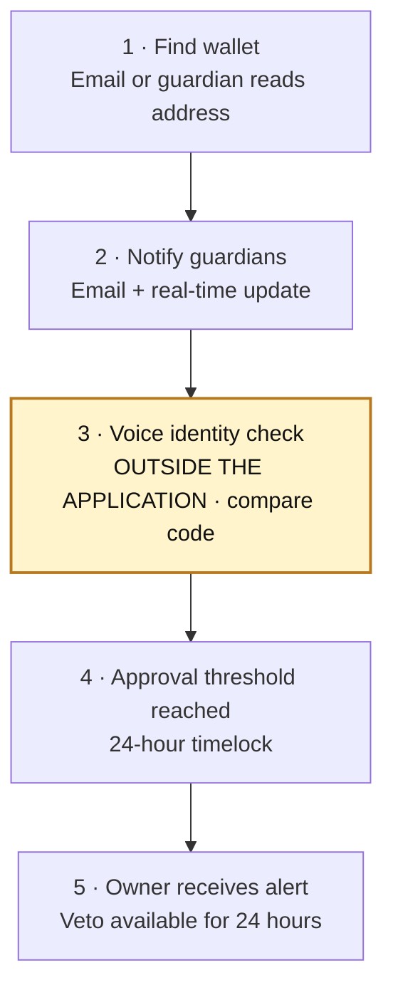
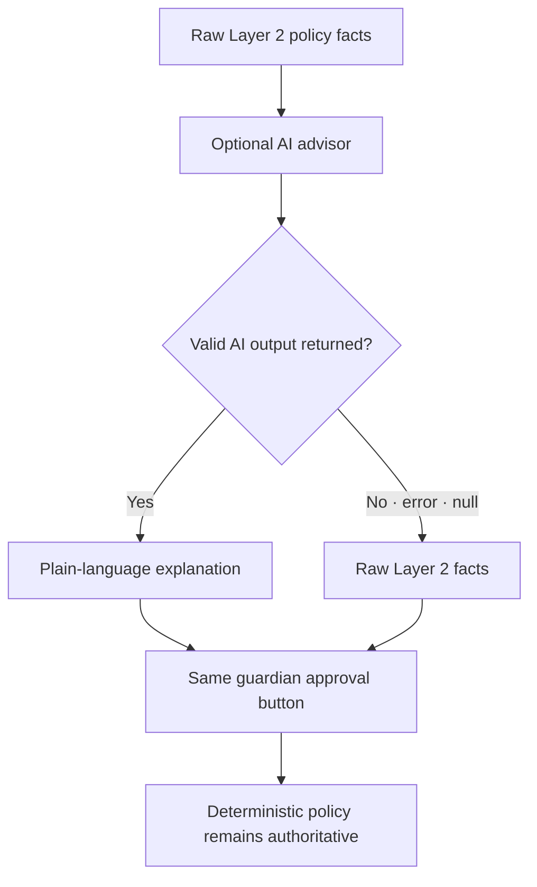
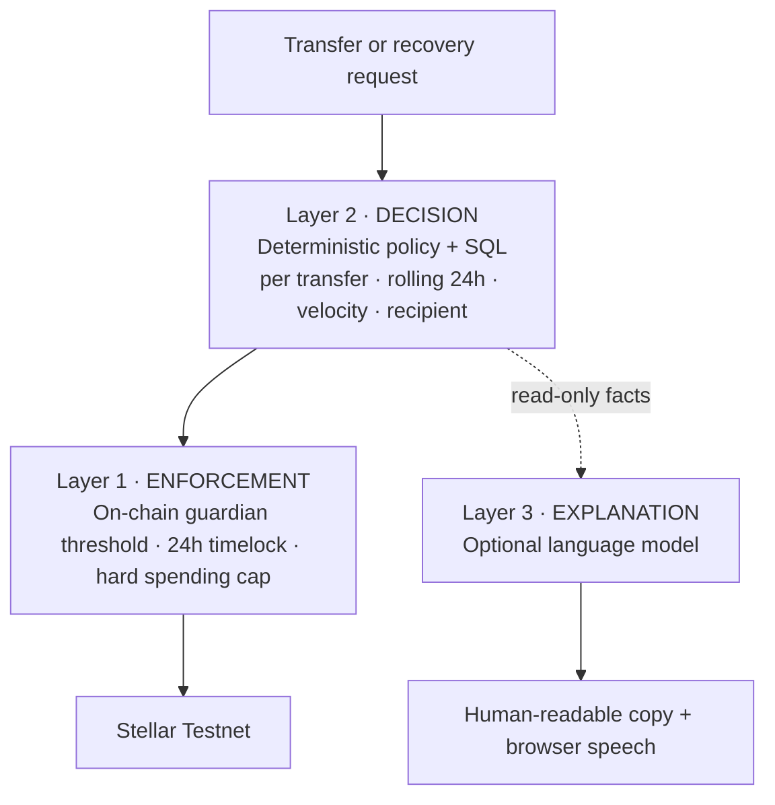

**[🇬🇧 English](README.md) · [🇻🇳 Tiếng Việt](README.vi.md) · [🇨🇳 中文](README.zh.md)**

<div align="center">


# FamilyHaven

**A Stellar smart wallet with no seed phrase - your family is the recovery mechanism.**

*Other wallets hand you twelve words to lose. This one hands you your family.*

APAC Stellar Hackathon 2026


**[🌐 Landing](https://familyhavenwallet.mscilabs.com/)** · **[↗ Live app](https://familyhaven.mscilabs.com)** · **[▶ Trailer](https://www.youtube.com/watch?v=K5jz1tClGng)** · **[▶ Demo video](https://youtu.be/8LUc_K2RAqY)** · **[⚡ Quick start](#quick-start)**

<a href="https://youtu.be/8LUc_K2RAqY">
  
</a>

**[▶ Watch the FamilyHaven Wallet Demo Video](https://youtu.be/8LUc_K2RAqY)**

Welcome, Stellar judges - the links above lead to the public story, the real Testnet application, the cinematic trailer, and the complete product demo.

</div>

## On-chain traction

A family wallet on Stellar. Passkeys replace seed phrases; trusted relatives are the recovery layer.

Live, verifiable on-chain activity - contracts, transactions and downloadable data: **[familyhavenwallet.mscilabs.com/traction](https://familyhavenwallet.mscilabs.com/traction)**

## Judge in 60 seconds

| | |
|---|---|
| **Problem** | Seed phrases turn wallet recovery into a single fragile secret. Losing it can lock out the owner; sharing it can give away the wallet. |
| **Solution** | A passkey-backed Stellar smart account keeps the signing key in the device Secure Enclave or TPM. Three or more chosen family guardians provide a threshold recovery path with a 24-hour timelock and owner veto. |
| **Result** | The owner can use and recover a real Testnet smart wallet without storing or typing twelve words. A direct chain watcher can alert them outside the application if recovery starts. |
| **Control** | Minimum guardian, threshold, timelock, rotation cooldown, and spending-cap rules are enforced on-chain. Publicly rebuilt contract hashes are independently visible on StellarExpert. |

## Product demo walkthrough

1. Open the [live app](https://familyhaven.mscilabs.com), create an account, and register a device passkey. No seed phrase is generated.
2. Add family guardians. The invitation page explains the role and risk before sign-in; recovery becomes active only after at least three guardian keys are on-chain.
3. Send XLM on Stellar Testnet. Everyday transfers follow user-configured soft limits; the policy contract measures spend and enforces the hard cap.
4. Start recovery from another device. Guardians approve, the 24-hour veto window remains visible, and a separate chain watcher can send an email even if the application indexer is unavailable.
5. Finalization rotates the smart-account signer. The former key stops working and a 300-second cooldown blocks immediate post-rotation racing.

This repository has **no canned demo mode**. Product flows use real Stellar Testnet contracts and transactions.

## Why it is technically different

| Capability | What it prevents |
|---|---|
| No seed phrase - passkey in Secure Enclave or TPM | Losing paper or entering twelve words into a phishing site |
| Minimum recovery constraints enforced **inside the contract** | A compromised server lowering recovery to one guardian or a zero-hour wait |
| **Two independent alert paths** - one process reads the contract directly and sends email outside the app | Silencing the owner by disabling only the indexer for 24 hours |
| 24-hour timelock plus on-chain owner veto | Colluding guardians taking the wallet immediately |
| Spending limit as a **policy contract** attached to OpenZeppelin authorization rules | A compromised server draining the wallet |
| Limit increases wait 24 hours | An account attacker raising the cap and withdrawing immediately |
| No “publisher guardian” | The application publisher recovering a user's wallet |
| 300-second cooldown after signer rotation | Racing a transaction immediately after the key changes |
| Append-only audit trail with role-level revocation | An administrator deleting evidence |
| Invitation page explains the role **before sign-in** | The product itself teaching users phishing habits |
| Deterministic SQL risk signals accompany guardian review | Approving another person's high-value transfer from only a 56-character address |
| Email wallet lookup returns the same accepted response for every email | Enumerating registered users and linking identities to on-chain balances |

### On-chain recovery invariants

These constraints are enforced by the deployed contracts, so control of the server cannot lower them:

| Invariant | Enforced value | Contract result |
|---|---:|---|
| `MIN_GUARDIANS` | `3` | panic `#4` on violation |
| `MIN_THRESHOLD` | `2` | panic `#3` on violation |
| `MIN_TIMELOCK_SECS` | `86,400` | panic `#17` on violation |
| Post-rotation cooldown | `300s` | code `#101` while active |

### Spending policy

| Layer | Default shown in the product | Change control |
|---|---:|---|
| Per transfer, soft and user-configurable | `1,000 XLM` | A decrease applies immediately |
| Rolling 24 hours, soft and user-configurable | `10,000 XLM` | An increase waits 24 hours, emails the owner, and is cancellable |
| Hard on-chain ceiling | `20,000 XLM` | Cannot be exceeded by the server |

### Deterministic risk signals

Before a transfer above the configured threshold is shown to a guardian, deterministic SQL queries calculate three signals - no model and no inference:

| Signal | What it measures |
|---|---|
| Velocity | Transfer count and total amount in the previous hour |
| Familiar or new recipient | Number of successful transfers previously sent to this address |
| Deviation from normal spend | Ratio to the 30-day average; omitted until at least three transactions exist |

These facts give a guardian reviewing someone else's money more context than a 56-character address. The approval view reads `policy_decision` and `policy_version` from that transfer's stored record instead of evaluating it again, so a later policy change cannot retroactively move an existing request across the threshold.

### Transfer flow



Below-threshold transfers proceed to the owner's signature. Above-threshold transfers keep their recorded policy result, wait for guardian approval, then return to the same owner-signing and on-chain enforcement path.

### Find a wallet without exposing an account list

A person who has lost a device may not remember a 56-character wallet address, but they usually remember their email. The lookup endpoint always returns `{"data":{"accepted":true}}`, whether or not the address exists; when a wallet does exist, the link is sent by email.

The wallet address is public on-chain, but the email-to-wallet mapping is not. Response timing is also covered by a test: the measured difference is **1.9 ms** (11.6 ms versus 9.7 ms) against a 100 ms threshold, and the endpoint is limited to 5 requests per 60 seconds.

### Guardian recovery alerts

When recovery starts, guardians receive both email and a real-time in-app update. Email matters because a guardian may not open the application for days - exactly when the wallet owner needs them.

The “Wallets I protect” screen shows the complete 56-character wallet address with a copy button, allowing a guardian to read it back to an owner who lost their device. Balance and transaction history remain hidden.

### Wallet recovery flow



The voice check deliberately happens outside FamilyHaven, while the displayed code binds that human check to the intended new key. Reaching the approval threshold starts the 24-hour timelock; the owner can still veto during that window.

## AI advisor: explanation, never authorization

The optional language model reads deterministic Layer 2 results and turns them into plain language for older adults. It does **not** decide whether a transfer proceeds: language models are non-deterministic, can receive prompt injection, and would create a fail-open gate if their outage removed a control.

The boundary is structural:

- Every failure returns `null`; the interface falls back to the **raw Layer 2 facts**, while the approval button and policy controls continue to work.
- No file in the transaction-send path imports the AI module; data flows one way into an optional explanation.
- The model has **no tools and no write permission**. A successful injection can at most produce a wrong sentence; it cannot fetch additional data, approve, or sign anything.
- Setting `AI_ADVISOR_ENABLED=false` removes the AI block while every protection remains active.

Model output passes deterministic post-validation or becomes `null`: conclusory terms such as “safe”, “dangerous”, or “should approve” are forbidden; every number must match the supplied facts; system-prompt repetition is detected; and the backend appends the disclaimer instead of trusting the model to do so. A speaker button uses the browser's Web Speech API, so reading the explanation aloud sends nothing off the device.

### AI fail-safe



Both branches end at the same approval control. AI availability changes presentation only; the deterministic decision and enforcement paths do not change.

## Architecture



Layer 1 remains the source of enforceable limits, while Layer 2 makes reproducible policy decisions from stored data. Layer 3 sits on a read-only side branch and has no route back into authorization.

### Technical stack

| Layer | Components |
|---|---|
| Contracts | Rust · Soroban SDK 26.1.1 · OpenZeppelin `stellar-accounts =0.7.2` · `wasm32v1-none` · stellar-cli 27.0.0 · rustc 1.97.1 |
| Backend | Bun · Hono 4.12 · Drizzle · PostgreSQL · Dragonfly · BullMQ · Better Auth 1.6 |
| Frontend | React 19 · Vite · TanStack Router/Query · three locales (`vi`, `en`, `zh`) |
| Deployment | Docker Compose with three pre-flight gates and zero-downtime rollout · Cloudflare Pages |
| Authentication | WebAuthn passkey · SEP-45 wallet session · no seed phrase anywhere in the codebase |

## Evidence, not promises

### Public contract verification

StellarExpert currently reports `validation.status = verified` for all five deployed contracts:

| Contract | Stellar Testnet ID | Status | Verified source |
|---|---|---|---|
| `recovery-registry` | [`CDGB…4JIR`](https://stellar.expert/explorer/testnet/contract/CDGBHEXSPNO4CJHYSSV4FZBN3C7XXQOPZPDATR65SH5QHRCDB2WL4JIR) | **verified** | [`da689235`](https://github.com/msci2049-hkt/vigiadinh/commit/da6892353e8b2076508e866efe9e1d13a7264ed4) |
| `origin-verifier` | [`CBFC…VVGW`](https://stellar.expert/explorer/testnet/contract/CBFCNHIOQN3N5IVSIVW4TTKYXZ73YQI4DZPADC6UCWF2XU35W4GVVWGW) | **verified** | [`da689235`](https://github.com/msci2049-hkt/vigiadinh/commit/da6892353e8b2076508e866efe9e1d13a7264ed4) |
| `web-auth` (SEP-45) | [`CBWM…JBWD`](https://stellar.expert/explorer/testnet/contract/CBWMHVEEXEOSOSWULYNYN62EYVMWJT55NKRPUI2MXSYHVVZ6NIMRJBWD) | **verified** | [`da689235`](https://github.com/msci2049-hkt/vigiadinh/commit/da6892353e8b2076508e866efe9e1d13a7264ed4) |
| `verifier-ed25519` | [`CC7L…VDEE`](https://stellar.expert/explorer/testnet/contract/CC7L7IGJ7ZBUQCYUTV6J6KLKMKYKAZIV5FMRISPNIZZW63664TWOVDEE) | **verified** | [`96957faa`](https://github.com/msci2049-hkt/vigiadinh/commit/96957faa46230744a56f90655b7994ff045c4844) |
| `spending-limit-policy` | [`CCIN…FJZK`](https://stellar.expert/explorer/testnet/contract/CCIN4CP4HAFNDBSS7ZILGKBTUNC2TDAMFCLSI7E2TW44SJ7R7FTSFJZK) | **verified** | [`96957faa`](https://github.com/msci2049-hkt/vigiadinh/commit/96957faa46230744a56f90655b7994ff045c4844) |

Verification means a rebuild from the linked public source matches the on-chain hash. It is **not** an independent security audit.

| Additional deployment identifier | Value |
|---|---|
| Network | **Stellar Testnet** |
| Smart-account WASM | `c1b28d42da1b7b091307c9acb0d72b88f45cc29d404b4d3c30bca0250a9d565f` |
| Fixed native SAC | [`CDLZ…CYSC`](https://stellar.expert/explorer/testnet/contract/CDLZFC3SYJYDZT7K67VZ75HPJVIEUVNIXF47ZG2FB2RMQQVU2HHGCYSC) |

### Reproducible gates and transaction evidence

| Quality gate | Result |
|---|---|
| Publicly verified contracts | **5/5** - three from `da689235`, two from `96957faa` |
| Contract tests (Rust) | **82 pass** |
| Backend tests | **566 pass**, **22 skip**; skipped cases require `RUN_TESTNET_E2E=1` |
| Frontend unit tests | **328 pass** |
| Total passing tests | **976 pass** |
| On-chain limit - below threshold | Passes **and is recorded in cumulative spend** |
| On-chain limit - one transfer above threshold | Rejected with `#3221` |
| On-chain limit - cumulative transfers exceed threshold | Rejected |
| On-chain limit - after the rolling window | Passes again |
| Rotation of a full **15-key** wallet | Succeeds with ledger evidence |
| 300-second cooldown | Blocks during the window and reopens on the boundary |
| Too few guardians | Rejected with `#4` |
| Recovery alert reading the chain directly | Email sent outside the application with `status=sent` |
| Unreplaced i18n placeholder gate | Present; rejects builds that contain unresolved placeholders |
| Append-only audit | Two layers: PostgreSQL trigger plus role-level permission revocation |

The recorded suites contain **976 passing tests**: 82 contract, 566 backend, and 328 frontend. The 22 backend cases that require `RUN_TESTNET_E2E=1` are reported as skips, not passes.

#### Clickable Testnet transactions

| Action | Transaction |
|---|---|
| Register wallet in the guardian registry | [`7d989c7cd38311e177230e576c59d4ba1a6bb46b4343f955ea733b6d353eae6e`](https://stellar.expert/explorer/testnet/tx/7d989c7cd38311e177230e576c59d4ba1a6bb46b4343f955ea733b6d353eae6e) |
| Send an above-threshold transfer after guardian approval | [`36a0c44f1158c4f569c0eb591bc4e74e2494cef05a6ec28ccc8b29d820ce2973`](https://stellar.expert/explorer/testnet/tx/36a0c44f1158c4f569c0eb591bc4e74e2494cef05a6ec28ccc8b29d820ce2973) |
| Open social recovery for a new key | [`14807debc73a5b7dbfaa6b65e69ee4900cff7660ffa0a6d1bfe1cb13c9b19d58`](https://stellar.expert/explorer/testnet/tx/14807debc73a5b7dbfaa6b65e69ee4900cff7660ffa0a6d1bfe1cb13c9b19d58) |

## Quick start

```bash
git clone https://github.com/msci2049-hkt/vigiadinh.git
cd vigiadinh

# Contracts
cd contracts && cargo test --workspace && stellar contract build

# Backend (:3000)
cd ../be && cp .env.example .env
# Fill DATABASE_URL, REDIS_URL, RESEND_API_KEY, and contract IDs.
bun install && bun run validate && bun test

# Frontend (:5173)
cd ../fe && pnpm install && pnpm validate && pnpm test && pnpm dev
```

There is **no scripted demo mode in this source tree**. Runtime flows operate against Stellar Testnet.

## Demo access

| | |
|---|---|
| Landing | [familyhavenwallet.mscilabs.com](https://familyhavenwallet.mscilabs.com/) |
| Live product | [familyhaven.mscilabs.com](https://familyhaven.mscilabs.com) |
| Network | **Stellar Testnet** |
| Demo mode | None - use a Testnet account and real Testnet flows |

## Repository map

```text
contracts/          recovery-registry · origin-verifier · web-auth · verifier-ed25519
                    smart-account · spending-limit-policy
be/                 modules: guardians · recovery · intents · notifications · inheritance
                    jobs: recovery-watch · indexer · presence · heartbeat · sweeper
fe/apps/web/        wallet · guardians · protecting · setup wizard · settings
docs/               VERIFY-CONTRACT.md · AUDIT-TINH-NANG.md · evidence/TESTNET.md
                    INHERITANCE.md · SEND-ADDRESSES.md · THREAT-MODEL.md
```

## Submission links

| | |
|---|---|
| 🌐 Project landing | [FamilyHaven](https://familyhavenwallet.mscilabs.com/) |
| ↗ Live product | [Open the Testnet app](https://familyhaven.mscilabs.com) |
| ▶ Trailer | [Family Haven 4K Introduction](https://www.youtube.com/watch?v=K5jz1tClGng) |
| ▶ Demo video | [FamilyHaven Wallet Demo Video](https://youtu.be/8LUc_K2RAqY) |
| ⌘ Source | [github.com/msci2049-hkt/vigiadinh](https://github.com/msci2049-hkt/vigiadinh) |
| ✉ Contact | [MSCI Labs](https://www.mscilabs.com) |

## Known limitations

| Limitation | Status |
|---|---|
| Guardian approval is a database record, **not yet an on-chain signature** | A compromised server could forge an approval. Identified internally; remediation is in progress |
| Passkeys are bound to the domain | Losing the domain removes the current signing path. A CLI signing recovery guide is being written |
| **No independent security audit yet** | Required before any mainnet release |
| The interface displays and spends XLM only | The wallet can receive any Stellar asset at protocol level; a spam-token filter is still needed |
| Hospital-care workflows and percentage inheritance | Roadmap items; not implemented |
| Testnet only | Intentional for this prototype; see the scope notice |

## Roadmap

### In-app voice and video checks for high-value transfers

Planned: when a transfer exceeds the configured approval threshold, a guardian will be able to start an in-app voice or video call from the pending request while the recipient, amount, and transaction fingerprint remain visible. The call will be a coordination layer, **not an authorization factor**; deterministic policy, guardian approval, and the owner's cryptographic signature will remain required. This feature is not implemented yet.

## Team

**[MSCI Labs](https://www.mscilabs.com)** - Vietnam

---

> **Scope.** Hackathon prototype on Stellar Testnet. No real funds. Policy thresholds are illustrative and user-configurable. Contract verification confirms the published source matches on-chain bytecode - it is not an independent security audit. Not financial advice.
