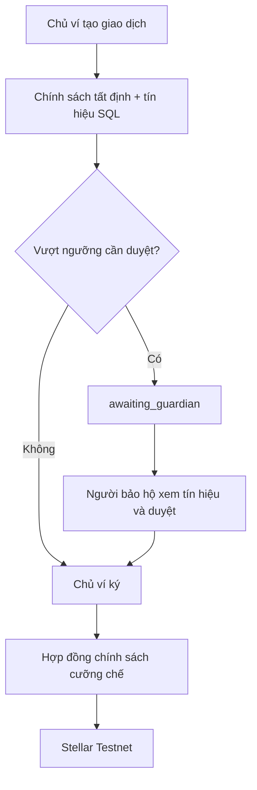
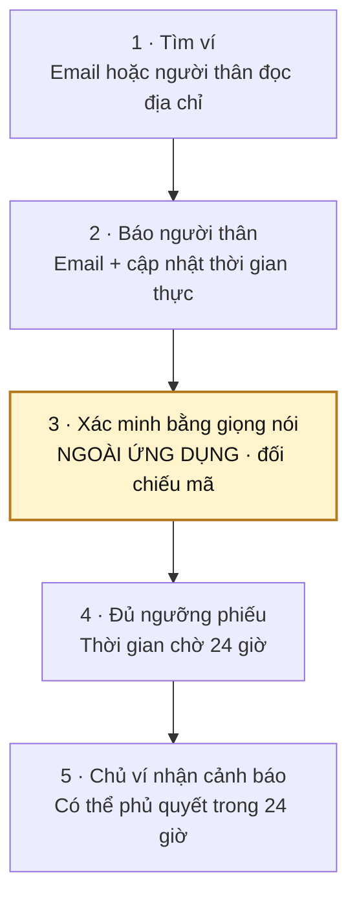
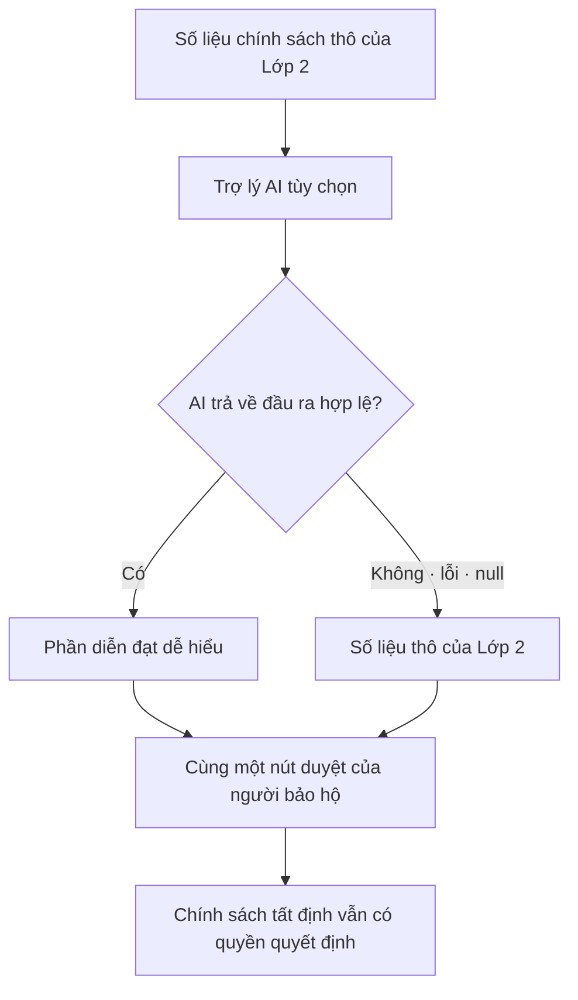
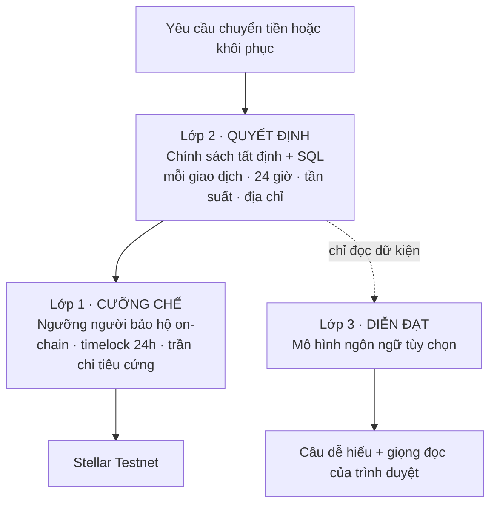

**[🇬🇧 English](README.md) · [🇻🇳 Tiếng Việt](README.vi.md) · [🇨🇳 中文](README.zh.md)**

<div align="center">


# VíGiaĐình

**Ví thông minh Stellar không cần seed phrase - chính gia đình là cơ chế khôi phục của bạn.**

*Ví khác đưa bạn mười hai từ để rồi có thể làm mất. Ví này trao cho bạn gia đình.*

APAC Stellar Hackathon 2026


**[🌐 Trang giới thiệu](https://familyhavenwallet.mscilabs.com/)** · **[↗ Ứng dụng thật](https://familyhaven.mscilabs.com)** · **[▶ Xem trailer 4K](https://www.youtube.com/watch?v=K5jz1tClGng)** · [Demo đầy đủ](https://youtu.be/8LUc_K2RAqY) · **[⚡ Bắt đầu nhanh](#bắt-đầu-nhanh)**

<a href="https://www.youtube.com/watch?v=K5jz1tClGng">
  
</a>

## **[▶ Xem Family Haven 4K Introduction](https://www.youtube.com/watch?v=K5jz1tClGng)**

Luồng sản phẩm đầy đủ: [FamilyHaven Wallet Demo Video](https://youtu.be/8LUc_K2RAqY)

Kính chào ban giám khảo Stellar - các liên kết phía trên dẫn tới câu chuyện dự án, ứng dụng Testnet thật, trailer điện ảnh và video demo sản phẩm đầy đủ.

</div>

## Hoạt động trên chuỗi

Quy trình triển khai lõi Mainnet đã được chuẩn bị có thể tái lập nhưng **chưa được thực hiện**; xem [runbook triển khai Mainnet](docs/MAINNET-DEPLOYMENT.md) và [trạng thái bằng chứng hiện tại](docs/MAINNET-EVIDENCE.md). Ứng dụng công khai và toàn bộ tiền người dùng vẫn ở Stellar Testnet.

Ví gia đình trên Stellar. Passkey thay cụm từ khôi phục; người thân là lớp khôi phục.

Hoạt động trên chuỗi, kiểm chứng được - hợp đồng, giao dịch và dữ liệu tải về: **[familyhavenwallet.mscilabs.com/traction](https://familyhavenwallet.mscilabs.com/traction)**

## Chấm trong 60 giây

| | |
|---|---|
| **Vấn đề** | Seed phrase biến việc khôi phục ví thành chuyện giữ một bí mật duy nhất và rất dễ mất. Mất thì có thể bị khóa khỏi ví; chia sẻ thì có thể mất cả ví. |
| **Giải pháp** | Tài khoản thông minh Stellar dùng passkey, giữ khóa ký trong Secure Enclave hoặc TPM của thiết bị. Từ ba người thân do chủ ví chọn tạo thành đường khôi phục theo ngưỡng, có thời gian chờ 24 giờ và quyền phủ quyết của chủ ví. |
| **Kết quả** | Chủ ví có thể dùng và khôi phục ví thông minh thật trên Testnet mà không phải lưu hay gõ mười hai từ. Một tiến trình đọc chuỗi khối trực tiếp có thể cảnh báo bên ngoài ứng dụng khi có yêu cầu khôi phục. |
| **Kiểm soát** | Số người bảo hộ tối thiểu, ngưỡng đồng ý, thời gian chờ, cooldown sau xoay khóa và trần chi tiêu đều được cưỡng chế trên chuỗi. Bản dựng lại công khai của hợp đồng được StellarExpert đối chiếu độc lập. |

## Luồng demo sản phẩm

1. Mở [ứng dụng thật](https://familyhaven.mscilabs.com), tạo tài khoản và đăng ký passkey của thiết bị. Hệ thống không sinh seed phrase.
2. Thêm người thân làm người bảo hộ. Trang nhận lời mời giải thích vai trò và rủi ro trước khi đăng nhập; khả năng khôi phục chỉ hoạt động khi có ít nhất ba khóa người bảo hộ trên chuỗi.
3. Gửi XLM trên Stellar Testnet. Giao dịch hằng ngày theo hạn mức mềm do người dùng đặt; hợp đồng chính sách đo tổng chi và cưỡng chế trần cứng.
4. Bắt đầu khôi phục từ thiết bị khác. Người bảo hộ đồng ý, cửa sổ phủ quyết 24 giờ vẫn hiển thị, còn tiến trình theo dõi độc lập có thể gửi email ngay cả khi bộ đánh chỉ mục của ứng dụng ngừng hoạt động.
5. Khi hoàn tất, hợp đồng xoay khóa ký của tài khoản thông minh. Khóa cũ ngừng hoạt động và cooldown 300 giây chặn cuộc đua giao dịch ngay sau khi đổi khóa.

Mã nguồn này **không có chế độ demo dựng sẵn**. Các luồng sản phẩm dùng hợp đồng và giao dịch thật trên Stellar Testnet.

## Vì sao khác biệt về kỹ thuật

| Năng lực | Ngăn được điều gì |
|---|---|
| Không seed phrase - passkey trong Secure Enclave hoặc TPM | Mất giấy hoặc bị lừa nhập mười hai từ vào trang giả |
| Giới hạn khôi phục tối thiểu được cưỡng chế **trong hợp đồng** | Kẻ chiếm máy chủ hạ cấu hình xuống một người bảo hộ hoặc không còn thời gian chờ |
| **Hai đường cảnh báo độc lập** - một tiến trình đọc hợp đồng trực tiếp và gửi email ngoài ứng dụng | Làm chủ ví im lặng bằng cách chỉ vô hiệu hóa bộ đánh chỉ mục trong 24 giờ |
| Thời gian chờ 24 giờ và quyền phủ quyết on-chain của chủ ví | Người bảo hộ thông đồng chiếm ví ngay lập tức |
| Hạn mức chi tiêu là **hợp đồng chính sách** gắn vào quy tắc ủy quyền OpenZeppelin | Máy chủ bị chiếm rút cạn ví |
| Nâng hạn mức phải chờ 24 giờ | Kẻ chiếm tài khoản nâng trần rồi rút ngay |
| Không có “người bảo hộ của nhà phát hành” | Nhà phát hành tự khôi phục ví của người dùng |
| Cooldown 300 giây sau khi xoay khóa | Chạy đua giao dịch ngay sau lúc đổi khóa |
| Nhật ký chỉ-ghi-thêm, thu hồi quyền ở cấp role | Quản trị viên xóa dấu vết |
| Trang nhận lời mời giải thích vai trò **trước khi đăng nhập** | Chính sản phẩm dạy người dùng thói quen dễ bị lừa |
| Tín hiệu rủi ro SQL tất định đi kèm màn hình duyệt của người bảo hộ | Duyệt giao dịch lớn của người khác chỉ dựa vào một địa chỉ 56 ký tự |
| Tra ví bằng email luôn trả cùng một phản hồi đã tiếp nhận | Dò danh sách người dùng rồi nối danh tính với số dư on-chain |

### Ràng buộc khôi phục trên chuỗi

Các ràng buộc này được cưỡng chế bởi hợp đồng đã triển khai, nên người chiếm máy chủ không thể hạ thấp:

| Bất biến | Giá trị cưỡng chế | Kết quả từ hợp đồng |
|---|---:|---|
| `MIN_GUARDIANS` | `3` | panic `#4` khi vi phạm |
| `MIN_THRESHOLD` | `2` | panic `#3` khi vi phạm |
| `MIN_TIMELOCK_SECS` | `86.400` | panic `#17` khi vi phạm |
| Cooldown sau xoay khóa | `300s` | mã `#101` khi còn hiệu lực |

### Chính sách chi tiêu

| Lớp kiểm soát | Mặc định hiển thị trong sản phẩm | Cách thay đổi |
|---|---:|---|
| Mỗi giao dịch, mềm và do người dùng đặt | `1.000 XLM` | Hạ ngưỡng có hiệu lực ngay |
| Cửa sổ 24 giờ, mềm và do người dùng đặt | `10.000 XLM` | Nâng ngưỡng phải chờ 24 giờ, gửi email cho chủ ví và có thể hủy |
| Trần cứng trên chuỗi | `20.000 XLM` | Máy chủ không thể vượt qua |

### Tín hiệu rủi ro tất định

Trước khi một giao dịch vượt ngưỡng được đưa cho người bảo hộ, các truy vấn SQL tất định tính ba tín hiệu - không dùng mô hình và không suy đoán:

| Tín hiệu | Đo gì |
|---|---|
| Tần suất | Số lệnh và tổng tiền trong một giờ gần nhất |
| Địa chỉ quen hay lạ | Số lần đã chuyển thành công tới địa chỉ này |
| So với mức thường ngày | Tỉ lệ so với trung bình 30 ngày; bỏ qua nếu chưa đủ ba giao dịch |

Những dữ kiện này giúp người bảo hộ đang duyệt tiền của người khác có nhiều căn cứ hơn một địa chỉ 56 ký tự. Màn hình duyệt đọc `policy_decision` và `policy_version` từ bản ghi của chính giao dịch, không đánh giá lại, nên thay đổi chính sách sau đó không thể đẩy ngược một yêu cầu đang tồn tại qua ngưỡng khác.

### Luồng gửi tiền



Giao dịch dưới ngưỡng đi thẳng tới bước chủ ví ký. Giao dịch vượt ngưỡng giữ nguyên kết quả chính sách đã ghi, chờ người bảo hộ duyệt rồi trở lại cùng đường ký của chủ ví và cưỡng chế on-chain.

### Tìm lại ví mà không để lộ danh sách tài khoản

Người mất thiết bị có thể không nhớ địa chỉ ví 56 ký tự, nhưng thường vẫn nhớ email. Endpoint tra cứu luôn trả `{"data":{"accepted":true}}` dù email có tồn tại hay không; nếu có ví, hệ thống gửi liên kết qua thư.

Địa chỉ ví là dữ liệu công khai trên chuỗi, còn ánh xạ email sang ví thì không. Thời gian phản hồi cũng được khóa bằng kiểm thử: chênh lệch đo được là **1,9 ms** (11,6 ms so với 9,7 ms) với ngưỡng 100 ms; endpoint được giới hạn 5 yêu cầu trong 60 giây.

### Cảnh báo khôi phục cho người bảo hộ

Khi có yêu cầu khôi phục, người bảo hộ nhận cả email và cập nhật thời gian thực trong ứng dụng. Email đặc biệt quan trọng vì người bảo hộ có thể nhiều ngày không mở ứng dụng - đúng lúc chủ ví cần họ nhất.

Màn hình “Ví tôi bảo vệ” hiển thị đầy đủ địa chỉ ví 56 ký tự kèm nút sao chép, để người bảo hộ đọc lại cho chủ ví đã mất thiết bị. Số dư và lịch sử giao dịch vẫn được ẩn.

### Luồng khôi phục ví



Bước xác minh bằng giọng nói chủ ý diễn ra ngoài VíGiaĐình; mã hiển thị dùng để gắn kết quả kiểm tra của con người với đúng khóa mới. Khi đủ ngưỡng phiếu, thời gian chờ 24 giờ bắt đầu và chủ ví vẫn có thể phủ quyết trong cửa sổ đó.

## Trợ lý AI: chỉ diễn đạt, không cấp quyền

Mô hình ngôn ngữ tùy chọn chỉ đọc kết quả tất định của Lớp 2 rồi chuyển thành câu dễ hiểu cho người lớn tuổi. Nó **không** quyết định giao dịch có được đi hay không: mô hình ngôn ngữ không tất định, có thể gặp prompt injection và sẽ tạo thành cổng fail-open nếu sự cố dịch vụ làm mất một lớp kiểm soát.

Ranh giới này nằm ngay trong kiến trúc:

- Mọi nhánh hỏng trả `null`; giao diện rơi về **khối số liệu thô của Lớp 2**, còn nút duyệt và hàng rào chính sách vẫn hoạt động.
- Không file nào trong đường gửi tiền import từ module AI; dữ liệu chỉ đi một chiều vào phần diễn đạt tùy chọn.
- Mô hình **không có công cụ và không có quyền ghi**. Prompt injection thành công tối đa tạo ra một câu sai; nó không thể tự truy xuất thêm dữ liệu, duyệt hay ký.
- Đặt `AI_ADVISOR_ENABLED=false` sẽ làm khối AI biến mất, mọi lớp bảo vệ vẫn còn nguyên.

Đầu ra mô hình phải qua hậu kiểm tất định, nếu sai sẽ thành `null`: cấm các từ mang tính kết luận như “an toàn”, “nguy hiểm” hoặc “nên duyệt”; mọi con số phải khớp dữ kiện đầu vào; phát hiện việc lặp lại system prompt; câu miễn trừ do backend nối vào thay vì tin mô hình tự thêm. Nút loa dùng Web Speech API của trình duyệt, nên việc đọc thành tiếng không gửi dữ liệu ra ngoài thiết bị.

### AI fail-safe



Cả hai nhánh đều dẫn tới cùng một nút duyệt. AI chỉ thay đổi cách trình bày; đường quyết định tất định và đường cưỡng chế không thay đổi.

## Kiến trúc



Lớp 1 là nguồn của các giới hạn có thể cưỡng chế, còn Lớp 2 đưa ra quyết định chính sách có thể tái lập từ dữ liệu đã lưu. Lớp 3 nằm trên một nhánh chỉ đọc và không có đường quay lại luồng cấp quyền.

### Ngăn xếp kỹ thuật

| Lớp | Thành phần |
|---|---|
| Hợp đồng | Rust · Soroban SDK 26.1.1 · OpenZeppelin `stellar-accounts =0.7.2` · `wasm32v1-none` · stellar-cli 27.0.0 · rustc 1.97.1 |
| Backend | Bun · Hono 4.12 · Drizzle · PostgreSQL · Dragonfly · BullMQ · Better Auth 1.6 |
| Frontend | React 19 · Vite · TanStack Router/Query · ba ngôn ngữ (`vi`, `en`, `zh`) |
| Triển khai | Docker Compose với ba cổng kiểm tra trước khi phát hành và cập nhật không gián đoạn · Cloudflare Pages |
| Xác thực | WebAuthn passkey · phiên ví SEP-45 · không có seed phrase ở bất kỳ đâu trong mã nguồn |

## Bằng chứng, không lời hứa

### Xác minh hợp đồng công khai

StellarExpert hiện trả về `validation.status = verified` cho cả năm hợp đồng đã triển khai:

| Hợp đồng | ID Stellar Testnet | Trạng thái | Mã nguồn đã xác minh |
|---|---|---|---|
| `recovery-registry` | [`CDGB…4JIR`](https://stellar.expert/explorer/testnet/contract/CDGBHEXSPNO4CJHYSSV4FZBN3C7XXQOPZPDATR65SH5QHRCDB2WL4JIR) | **verified** | [`da689235`](https://github.com/msci2049-hkt/vigiadinh/commit/da6892353e8b2076508e866efe9e1d13a7264ed4) |
| `origin-verifier` | [`CBFC…VVGW`](https://stellar.expert/explorer/testnet/contract/CBFCNHIOQN3N5IVSIVW4TTKYXZ73YQI4DZPADC6UCWF2XU35W4GVVWGW) | **verified** | [`da689235`](https://github.com/msci2049-hkt/vigiadinh/commit/da6892353e8b2076508e866efe9e1d13a7264ed4) |
| `web-auth` (SEP-45) | [`CBWM…JBWD`](https://stellar.expert/explorer/testnet/contract/CBWMHVEEXEOSOSWULYNYN62EYVMWJT55NKRPUI2MXSYHVVZ6NIMRJBWD) | **verified** | [`da689235`](https://github.com/msci2049-hkt/vigiadinh/commit/da6892353e8b2076508e866efe9e1d13a7264ed4) |
| `verifier-ed25519` | [`CC7L…VDEE`](https://stellar.expert/explorer/testnet/contract/CC7L7IGJ7ZBUQCYUTV6J6KLKMKYKAZIV5FMRISPNIZZW63664TWOVDEE) | **verified** | [`96957faa`](https://github.com/msci2049-hkt/vigiadinh/commit/96957faa46230744a56f90655b7994ff045c4844) |
| `spending-limit-policy` | [`CCIN…FJZK`](https://stellar.expert/explorer/testnet/contract/CCIN4CP4HAFNDBSS7ZILGKBTUNC2TDAMFCLSI7E2TW44SJ7R7FTSFJZK) | **verified** | [`96957faa`](https://github.com/msci2049-hkt/vigiadinh/commit/96957faa46230744a56f90655b7994ff045c4844) |

Dấu xác minh nghĩa là bản dựng lại từ mã nguồn công khai được liên kết khớp mã băm on-chain. Đây **không phải** kiểm định an ninh độc lập.

| Định danh triển khai bổ sung | Giá trị |
|---|---|
| Mạng | **Stellar Testnet** |
| Smart-account WASM | `c1b28d42da1b7b091307c9acb0d72b88f45cc29d404b4d3c30bca0250a9d565f` |
| SAC native cố định | [`CDLZ…CYSC`](https://stellar.expert/explorer/testnet/contract/CDLZFC3SYJYDZT7K67VZ75HPJVIEUVNIXF47ZG2FB2RMQQVU2HHGCYSC) |

### Cổng kiểm tra và bằng chứng giao dịch có thể chạy lại

| Cổng chất lượng | Kết quả |
|---|---|
| Hợp đồng verified công khai | **5/5** - ba hợp đồng từ `da689235`, hai hợp đồng từ `96957faa` |
| Kiểm thử hợp đồng Rust | **82 pass** |
| Kiểm thử backend | **566 pass**, **22 skip**; các ca skip cần `RUN_TESTNET_E2E=1` |
| Kiểm thử frontend | **328 pass** |
| Tổng số kiểm thử đạt | **976 pass** |
| Hạn mức on-chain - dưới ngưỡng | Pass **và được ghi nhận vào tổng đã chi** |
| Hạn mức on-chain - vượt trong một giao dịch | Bị chối với `#3221` |
| Hạn mức on-chain - nhiều giao dịch cộng dồn vượt ngưỡng | Bị chối |
| Hạn mức on-chain - qua cửa sổ trượt | Pass trở lại |
| Xoay ví đầy **15 khóa** | Thành công, có bằng chứng ledger |
| Cooldown 300 giây | Chặn trong cửa sổ và mở đúng tại biên |
| Thiếu người bảo hộ | Bị chối với `#4` |
| Cảnh báo khôi phục đọc chuỗi trực tiếp | Email được gửi ngoài ứng dụng với `status=sent` |
| Cổng chặn placeholder i18n chưa thay | Có; từ chối bản dựng còn placeholder chưa được thay |
| Nhật ký chỉ-ghi-thêm | Hai lớp: trigger PostgreSQL và thu hồi quyền ở cấp role |

Các bộ kiểm thử ghi nhận **976 ca đạt**: 82 ở hợp đồng, 566 ở backend và 328 ở frontend. 22 ca backend cần `RUN_TESTNET_E2E=1` được báo là skip, không tính thành pass.

#### Giao dịch Testnet có thể bấm để kiểm chứng

| Việc | Giao dịch |
|---|---|
| Đăng ký ví lên sổ người bảo hộ | [`7d989c7cd38311e177230e576c59d4ba1a6bb46b4343f955ea733b6d353eae6e`](https://stellar.expert/explorer/testnet/tx/7d989c7cd38311e177230e576c59d4ba1a6bb46b4343f955ea733b6d353eae6e) |
| Gửi giao dịch vượt ngưỡng sau khi người bảo hộ duyệt | [`36a0c44f1158c4f569c0eb591bc4e74e2494cef05a6ec28ccc8b29d820ce2973`](https://stellar.expert/explorer/testnet/tx/36a0c44f1158c4f569c0eb591bc4e74e2494cef05a6ec28ccc8b29d820ce2973) |
| Mở khôi phục xã hội cho khóa mới | [`14807debc73a5b7dbfaa6b65e69ee4900cff7660ffa0a6d1bfe1cb13c9b19d58`](https://stellar.expert/explorer/testnet/tx/14807debc73a5b7dbfaa6b65e69ee4900cff7660ffa0a6d1bfe1cb13c9b19d58) |

## Bắt đầu nhanh

```bash
git clone https://github.com/msci2049-hkt/vigiadinh.git
cd vigiadinh

# Hợp đồng
cd contracts && cargo test --workspace && stellar contract build

# Backend (:3000)
cd ../be && cp .env.example .env
# Điền DATABASE_URL, REDIS_URL, RESEND_API_KEY và các contract ID.
bun install && bun run validate && bun test

# Frontend (:5173)
cd ../fe && pnpm install && pnpm validate && pnpm test && pnpm dev
```

Cây mã nguồn này **không có chế độ demo dựng sẵn**. Các luồng khi chạy làm việc với Stellar Testnet.

## Truy cập bản demo

| | |
|---|---|
| Trang giới thiệu | [familyhavenwallet.mscilabs.com](https://familyhavenwallet.mscilabs.com/) |
| Ứng dụng thật | [familyhaven.mscilabs.com](https://familyhaven.mscilabs.com) |
| Mạng | **Stellar Testnet** |
| Chế độ demo | Không có - dùng tài khoản Testnet và luồng Testnet thật |

## Bản đồ mã nguồn

```text
contracts/          recovery-registry · origin-verifier · web-auth · verifier-ed25519
                    smart-account · spending-limit-policy
be/                 modules: guardians · recovery · intents · notifications · inheritance
                    jobs: recovery-watch · indexer · presence · heartbeat · sweeper
fe/apps/web/        wallet · guardians · protecting · setup wizard · settings
docs/               VERIFY-CONTRACT.md · AUDIT-TINH-NANG.md · evidence/TESTNET.md
                    INHERITANCE.md · SEND-ADDRESSES.md · THREAT-MODEL.md
```

## Liên kết bài dự thi

| | |
|---|---|
| 🌐 Trang dự án | [VíGiaĐình](https://familyhavenwallet.mscilabs.com/) |
| ↗ Ứng dụng thật | [Mở ứng dụng Testnet](https://familyhaven.mscilabs.com) |
| ▶ Trailer | [Family Haven 4K Introduction](https://www.youtube.com/watch?v=K5jz1tClGng) |
| ▶ Video demo | [FamilyHaven Wallet Demo Video](https://youtu.be/8LUc_K2RAqY) |
| ⌘ Mã nguồn | [github.com/msci2049-hkt/vigiadinh](https://github.com/msci2049-hkt/vigiadinh) |
| ✉ Liên hệ | [MSCI Labs](https://www.mscilabs.com) |

## Giới hạn đã biết

| Giới hạn | Trạng thái |
|---|---|
| Phiếu đồng ý của người bảo hộ là bản ghi cơ sở dữ liệu, **chưa phải chữ ký on-chain** | Máy chủ bị chiếm có thể giả phiếu. Đã tự phát hiện; đang sửa |
| Passkey gắn với tên miền | Mất tên miền sẽ mất đường ký hiện tại. Hướng dẫn ký khôi phục bằng CLI đang được viết |
| **Chưa có kiểm định an ninh độc lập** | Điều kiện bắt buộc trước khi lên mạng chính |
| Giao diện chỉ hiển thị và chi XLM | Ví có thể nhận mọi tài sản Stellar ở cấp giao thức; vẫn cần bộ lọc token rác |
| Luồng chăm sóc khi nằm viện và chia thừa kế theo phần trăm | Thuộc lộ trình; chưa được triển khai |
| Chỉ Testnet | Chủ ý của bản mẫu; xem ghi chú phạm vi |

## Lộ trình

### Gọi thoại và video trong ví khi duyệt giao dịch lớn

Theo lộ trình, khi giao dịch vượt ngưỡng cần duyệt, người bảo hộ sẽ có thể gọi thoại hoặc video ngay từ yêu cầu đang chờ trong khi người nhận, số tiền và dấu tay giao dịch vẫn hiển thị. Cuộc gọi là lớp phối hợp, **không phải yếu tố cấp quyền**; chính sách tất định, phiếu duyệt của người bảo hộ và chữ ký mật mã của chủ ví vẫn bắt buộc. Tính năng này chưa được triển khai.

## Đội ngũ

**[MSCI Labs](https://www.mscilabs.com)** - Vietnam

---

> **Phạm vi.** Bản mẫu hackathon chạy trên Stellar Testnet. Không dùng tiền thật. Các ngưỡng chính sách chỉ có tính minh họa và người dùng có thể cấu hình. Xác minh hợp đồng chỉ xác nhận mã nguồn đã công bố khớp bytecode on-chain - không phải kiểm định an ninh độc lập. Đây không phải lời khuyên tài chính.
