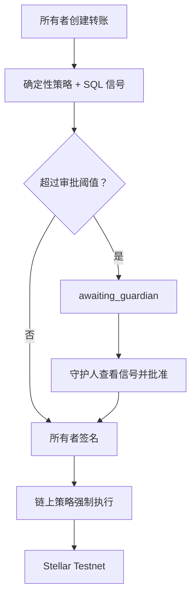
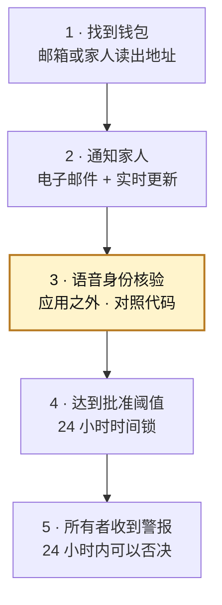
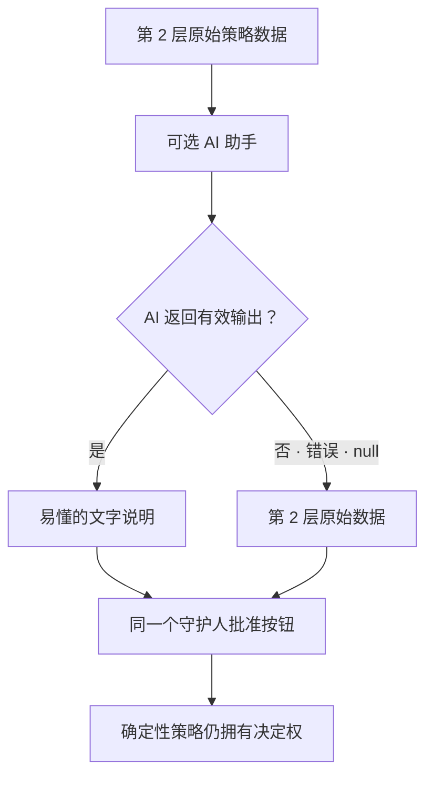
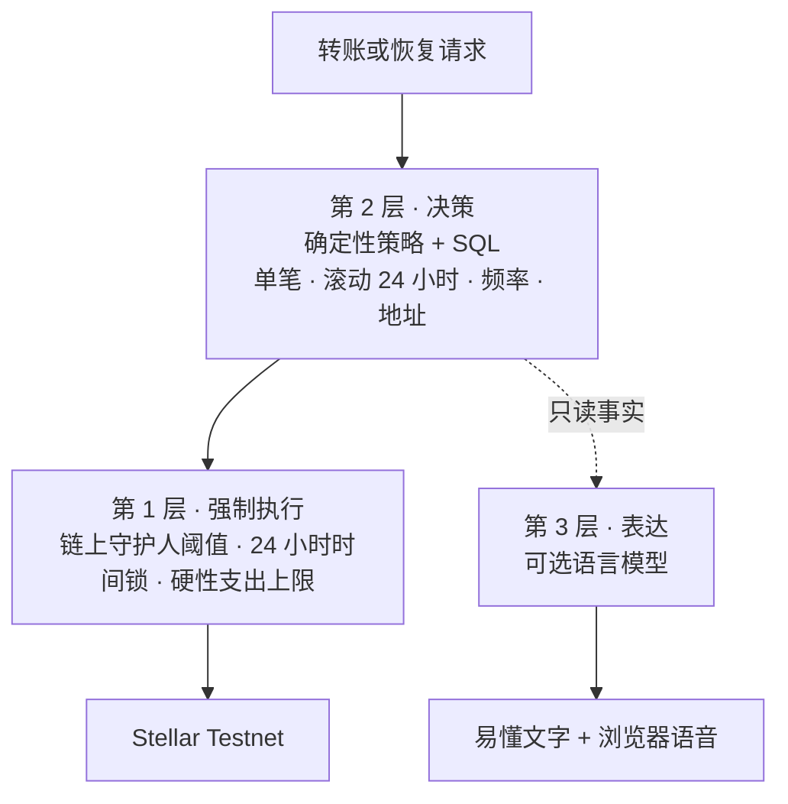

**[🇬🇧 English](README.md) · [🇻🇳 Tiếng Việt](README.vi.md) · [🇨🇳 中文](README.zh.md)**

<div align="center">


# FamilyHaven

**无需助记词的 Stellar 智能钱包-家人就是你的恢复机制。**

*其他钱包给你十二个可能丢失的单词；这个钱包把恢复权交给你的家人。*

APAC Stellar Hackathon 2026


**[🌐 项目主页](https://familyhavenwallet.mscilabs.com/)** · **[↗ 在线应用](https://familyhaven.mscilabs.com)** · **[▶ 演示视频](https://youtu.be/8LUc_K2RAqY)** · **[⚡ 快速开始](#快速开始)**

<a href="https://youtu.be/8LUc_K2RAqY">
  
</a>

**[▶ 观看 FamilyHaven Wallet Demo Video](https://youtu.be/8LUc_K2RAqY)**

欢迎 Stellar 评委-上方链接分别指向项目说明、真实 Testnet 应用和完整产品演示视频。

</div>

## 链上活动

Stellar 上的家庭钱包。以 Passkey 取代助记词，由亲人组成恢复层。

可验证的链上活动-合约、交易与可下载数据：**[familyhavenwallet.mscilabs.com/traction](https://familyhavenwallet.mscilabs.com/traction)**

## 60 秒评审

| | |
|---|---|
| **问题** | 助记词把钱包恢复压在一个脆弱的秘密上。丢失它可能永远失去访问权；分享它又可能交出整个钱包。 |
| **方案** | 由通行密钥保护的 Stellar 智能账户把签名密钥留在设备的 Secure Enclave 或 TPM 中。用户选择至少三位家人作为守护人，通过阈值投票、24 小时时间锁和所有者否决权完成恢复。 |
| **结果** | 所有者无需保存或输入十二个单词，即可使用并恢复真实的 Testnet 智能钱包。独立的链上监视进程能在恢复启动时从应用外部发送警报。 |
| **控制** | 最少守护人数、阈值、时间锁、密钥轮换冷却期和消费上限均由链上逻辑强制执行。StellarExpert 可公开检查合约源码重建结果。 |

## 产品演示流程

1. 打开[在线应用](https://familyhaven.mscilabs.com)，创建账户并注册设备通行密钥。系统不会生成助记词。
2. 添加家人作为守护人。邀请页会在登录前说明职责与风险；只有至少三把守护人密钥上链后，恢复能力才会启用。
3. 在 Stellar Testnet 上发送 XLM。日常转账遵循用户配置的软限额；策略合约记录累计支出并强制执行硬上限。
4. 从另一台设备发起恢复。守护人批准后，24 小时否决窗口仍然有效；即使应用索引器不可用，独立链上监视进程仍可发送电子邮件。
5. 最终执行会轮换智能账户签名者。旧密钥立即失效，300 秒冷却期阻止密钥变更后的抢跑交易。

本仓库**没有预先编排的演示模式**。产品流程使用真实的 Stellar Testnet 合约和交易。

## 技术上有何不同

| 能力 | 防止的问题 |
|---|---|
| 无助记词-通行密钥保存在 Secure Enclave 或 TPM | 丢失纸张，或被钓鱼网站诱导输入十二个单词 |
| 最低恢复约束在**合约内部**强制执行 | 被入侵的服务器把恢复降为一名守护人或零等待时间 |
| **两条独立警报路径**-一个进程直接读取合约，并从应用外发送电子邮件 | 攻击者只停用索引器 24 小时就让所有者收不到警报 |
| 24 小时时间锁和链上所有者否决权 | 守护人串通后立即夺取钱包 |
| 消费限额是附着在 OpenZeppelin 授权规则上的**策略合约** | 被入侵的服务器清空钱包 |
| 提高限额必须等待 24 小时 | 账户攻击者先提高上限再立即提款 |
| 不存在“发行方守护人” | 应用发行方自行恢复用户钱包 |
| 签名者轮换后冷却 300 秒 | 密钥更换后立即抢跑交易 |
| 仅追加审计日志，并在角色层撤销修改权限 | 管理员删除痕迹 |
| 邀请页在**登录前**解释职责 | 产品本身培养容易受骗的使用习惯 |
| 确定性 SQL 风险信号随守护人审批请求一同显示 | 仅凭一个 56 字符地址审批他人的大额转账 |
| 邮箱找回钱包对任何地址都返回相同的已接受响应 | 枚举注册用户，并把身份与链上余额关联起来 |

### 链上恢复不变量

这些约束由已部署合约强制执行，因此控制服务器的人也无法降低约束：

| 不变量 | 强制值 | 合约结果 |
|---|---:|---|
| `MIN_GUARDIANS` | `3` | 违反时 panic `#4` |
| `MIN_THRESHOLD` | `2` | 违反时 panic `#3` |
| `MIN_TIMELOCK_SECS` | `86,400` | 违反时 panic `#17` |
| 轮换后冷却期 | `300s` | 生效期间返回代码 `#101` |

### 消费策略

| 控制层 | 产品显示的默认值 | 变更控制 |
|---|---:|---|
| 单笔软限额，用户可配置 | `1,000 XLM` | 降低限额立即生效 |
| 滚动 24 小时软限额，用户可配置 | `10,000 XLM` | 提高限额等待 24 小时、向所有者发邮件，并可取消 |
| 链上硬上限 | `20,000 XLM` | 服务器无法绕过 |

### 确定性风险信号

超过配置阈值的转账在交给守护人审批前，会通过确定性 SQL 查询计算三项信号-不使用模型，也不进行推测：

| 信号 | 衡量内容 |
|---|---|
| 频率 | 最近一小时的转账笔数与总金额 |
| 熟悉或陌生的收款地址 | 过去成功转账至该地址的次数 |
| 与日常支出的偏差 | 相对于 30 天平均值的比率；不足三笔交易时省略 |

这些事实让正在审批他人资金的守护人获得比一个 56 字符地址更多的判断依据。审批界面直接读取该笔转账记录中的 `policy_decision` 和 `policy_version`，不会重新评估，因此后续策略变化不能追溯性地改变已有请求所处的阈值分支。

### 转账流程



低于阈值的转账直接进入所有者签名步骤。高于阈值的转账保留已记录的策略结果，等待守护人批准，然后回到同一条所有者签名和链上强制执行路径。

### 找回钱包而不暴露账户名单

丢失设备的人可能不记得 56 字符的钱包地址，但通常记得邮箱。无论邮箱是否存在，查询端点始终返回 `{"data":{"accepted":true}}`；如果存在对应钱包，系统会通过邮件发送链接。

钱包地址是链上公开数据，但邮箱到钱包的映射不是。响应时间同样由测试约束：实测差异为 **1.9 ms**（11.6 ms 对 9.7 ms），阈值为 100 ms；端点还限制为每 60 秒 5 次请求。

### 守护人恢复警报

恢复请求发起后，守护人会同时收到电子邮件和应用内实时更新。电子邮件尤其重要，因为守护人可能多日不打开应用，而这往往正是钱包所有者最需要他们的时候。

“我守护的钱包”页面显示完整的 56 字符钱包地址并提供复制按钮，守护人可将其读给丢失设备的所有者。余额和交易历史仍保持隐藏。

### 钱包恢复流程



语音核验有意在 FamilyHaven 之外进行；显示的代码把人工核验结果绑定到预期的新密钥。达到批准阈值后，24 小时时间锁开始，所有者在此窗口内仍可否决。

## AI 助手：只做表达，不做授权

可选的语言模型只读取第 2 层的确定性结果，并将其改写成更便于年长用户理解的语言。它**不**决定转账是否继续：语言模型具有非确定性，可能遭遇提示注入；如果服务中断就让控制失效，它便会成为 fail-open 门。

这一边界由架构保证：

- 任何失败分支都返回 `null`；界面回退到**第 2 层原始数据**，批准按钮和策略控制仍可工作。
- 转账发送路径中的任何文件都不导入 AI 模块；数据只单向进入可选的解释层。
- 模型**没有工具，也没有写权限**。成功的提示注入最多生成错误句子；它不能自行获取额外数据、批准或签名。
- 设置 `AI_ADVISOR_ENABLED=false` 会移除 AI 区块，而所有保护保持有效。

模型输出必须通过确定性后置校验，否则返回 `null`：禁止“安全”“危险”“应该批准”等结论性措辞；所有数字必须与输入事实一致；检测对 system prompt 的复述；免责声明由后端追加，不依赖模型自行生成。朗读按钮使用浏览器的 Web Speech API，因此语音朗读不会把数据发送到设备之外。

### AI fail-safe



两条分支最终都到达同一个批准控件。AI 是否可用只改变呈现方式；确定性决策路径和强制执行路径保持不变。

## 架构



第 1 层是可强制执行限制的事实来源，第 2 层依据存储数据作出可复现的策略决策。第 3 层位于只读旁路，不存在返回授权路径的通道。

### 技术栈

| 层 | 组件 |
|---|---|
| 合约 | Rust · Soroban SDK 26.1.1 · OpenZeppelin `stellar-accounts =0.7.2` · `wasm32v1-none` · stellar-cli 27.0.0 · rustc 1.97.1 |
| 后端 | Bun · Hono 4.12 · Drizzle · PostgreSQL · Dragonfly · BullMQ · Better Auth 1.6 |
| 前端 | React 19 · Vite · TanStack Router/Query · 三种语言（`vi`、`en`、`zh`） |
| 部署 | Docker Compose，包含三个发布前检查和零停机发布 · Cloudflare Pages |
| 身份验证 | WebAuthn 通行密钥 · SEP-45 钱包会话 · 代码库中任何位置都没有助记词 |

## 证据，而非承诺

### 公开合约验证

StellarExpert 目前为五个已部署合约全部返回 `validation.status = verified`：

| 合约 | Stellar Testnet ID | 状态 | 已验证源码 |
|---|---|---|---|
| `recovery-registry` | [`CDGB…4JIR`](https://stellar.expert/explorer/testnet/contract/CDGBHEXSPNO4CJHYSSV4FZBN3C7XXQOPZPDATR65SH5QHRCDB2WL4JIR) | **verified** | [`da689235`](https://github.com/msci2049-hkt/vigiadinh/commit/da6892353e8b2076508e866efe9e1d13a7264ed4) |
| `origin-verifier` | [`CBFC…VVGW`](https://stellar.expert/explorer/testnet/contract/CBFCNHIOQN3N5IVSIVW4TTKYXZ73YQI4DZPADC6UCWF2XU35W4GVVWGW) | **verified** | [`da689235`](https://github.com/msci2049-hkt/vigiadinh/commit/da6892353e8b2076508e866efe9e1d13a7264ed4) |
| `web-auth`（SEP-45） | [`CBWM…JBWD`](https://stellar.expert/explorer/testnet/contract/CBWMHVEEXEOSOSWULYNYN62EYVMWJT55NKRPUI2MXSYHVVZ6NIMRJBWD) | **verified** | [`da689235`](https://github.com/msci2049-hkt/vigiadinh/commit/da6892353e8b2076508e866efe9e1d13a7264ed4) |
| `verifier-ed25519` | [`CC7L…VDEE`](https://stellar.expert/explorer/testnet/contract/CC7L7IGJ7ZBUQCYUTV6J6KLKMKYKAZIV5FMRISPNIZZW63664TWOVDEE) | **verified** | [`96957faa`](https://github.com/msci2049-hkt/vigiadinh/commit/96957faa46230744a56f90655b7994ff045c4844) |
| `spending-limit-policy` | [`CCIN…FJZK`](https://stellar.expert/explorer/testnet/contract/CCIN4CP4HAFNDBSS7ZILGKBTUNC2TDAMFCLSI7E2TW44SJ7R7FTSFJZK) | **verified** | [`96957faa`](https://github.com/msci2049-hkt/vigiadinh/commit/96957faa46230744a56f90655b7994ff045c4844) |

验证表示从所链接的公开源码重建后，哈希与链上代码一致。它**不是**独立安全审计。

| 其他部署标识 | 值 |
|---|---|
| 网络 | **Stellar Testnet** |
| Smart-account WASM | `c1b28d42da1b7b091307c9acb0d72b88f45cc29d404b4d3c30bca0250a9d565f` |
| 固定原生 SAC | [`CDLZ…CYSC`](https://stellar.expert/explorer/testnet/contract/CDLZFC3SYJYDZT7K67VZ75HPJVIEUVNIXF47ZG2FB2RMQQVU2HHGCYSC) |

### 可复现检查与交易证据

| 质量门 | 结果 |
|---|---|
| 公开验证合约 | **5/5**-三个来自 `da689235`，两个来自 `96957faa` |
| Rust 合约测试 | **82 pass** |
| 后端测试 | **566 pass**，**22 skip**；跳过项需要 `RUN_TESTNET_E2E=1` |
| 前端单元测试 | **328 pass** |
| 通过测试总数 | **976 pass** |
| 链上限额-低于阈值 | 通过，**并计入累计支出** |
| 链上限额-单笔超过阈值 | 以 `#3221` 拒绝 |
| 链上限额-多笔累计超过阈值 | 拒绝 |
| 链上限额-滚动窗口结束后 | 再次通过 |
| 对含 **15 把密钥**的钱包执行轮换 | 成功，并有账本证据 |
| 300 秒冷却期 | 窗口内阻止，边界到达时重新开放 |
| 守护人数不足 | 以 `#4` 拒绝 |
| 直接读取链上状态的恢复警报 | 从应用外发送邮件，`status=sent` |
| 未替换 i18n 占位符检查 | 已存在；含未替换占位符的构建会被拒绝 |
| 仅追加审计 | 两层：PostgreSQL 触发器和角色级权限撤销 |

测试套件共记录 **976 项通过**：合约 82 项、后端 566 项、前端 328 项。需要 `RUN_TESTNET_E2E=1` 的 22 项后端用例报告为 skip，不计入通过数。

#### 可点击验证的 Testnet 交易

| 操作 | 交易 |
|---|---|
| 将钱包注册到守护人登记表 | [`7d989c7cd38311e177230e576c59d4ba1a6bb46b4343f955ea733b6d353eae6e`](https://stellar.expert/explorer/testnet/tx/7d989c7cd38311e177230e576c59d4ba1a6bb46b4343f955ea733b6d353eae6e) |
| 守护人批准后发送超过阈值的转账 | [`36a0c44f1158c4f569c0eb591bc4e74e2494cef05a6ec28ccc8b29d820ce2973`](https://stellar.expert/explorer/testnet/tx/36a0c44f1158c4f569c0eb591bc4e74e2494cef05a6ec28ccc8b29d820ce2973) |
| 为新密钥发起社会化恢复 | [`14807debc73a5b7dbfaa6b65e69ee4900cff7660ffa0a6d1bfe1cb13c9b19d58`](https://stellar.expert/explorer/testnet/tx/14807debc73a5b7dbfaa6b65e69ee4900cff7660ffa0a6d1bfe1cb13c9b19d58) |

## 快速开始

```bash
git clone https://github.com/msci2049-hkt/vigiadinh.git
cd vigiadinh

# 合约
cd contracts && cargo test --workspace && stellar contract build

# 后端 (:3000)
cd ../be && cp .env.example .env
# 填写 DATABASE_URL、REDIS_URL、RESEND_API_KEY 和合约 ID。
bun install && bun run validate && bun test

# 前端 (:5173)
cd ../fe && pnpm install && pnpm validate && pnpm test && pnpm dev
```

本源码树**没有预先编排的演示模式**。运行时流程连接 Stellar Testnet。

## 演示访问

| | |
|---|---|
| 项目主页 | [familyhavenwallet.mscilabs.com](https://familyhavenwallet.mscilabs.com/) |
| 在线产品 | [familyhaven.mscilabs.com](https://familyhaven.mscilabs.com) |
| 网络 | **Stellar Testnet** |
| 演示模式 | 无-使用 Testnet 账户和真实 Testnet 流程 |

## 源码地图

```text
contracts/          recovery-registry · origin-verifier · web-auth · verifier-ed25519
                    smart-account · spending-limit-policy
be/                 modules: guardians · recovery · intents · notifications · inheritance
                    jobs: recovery-watch · indexer · presence · heartbeat · sweeper
fe/apps/web/        wallet · guardians · protecting · setup wizard · settings
docs/               VERIFY-CONTRACT.md · AUDIT-TINH-NANG.md · evidence/TESTNET.md
                    INHERITANCE.md · SEND-ADDRESSES.md · THREAT-MODEL.md
```

## 参赛链接

| | |
|---|---|
| 🌐 项目主页 | [FamilyHaven](https://familyhavenwallet.mscilabs.com/) |
| ↗ 在线产品 | [打开 Testnet 应用](https://familyhaven.mscilabs.com) |
| ▶ 演示视频 | [FamilyHaven Wallet Demo Video](https://youtu.be/8LUc_K2RAqY) |
| ⌘ 源码 | [github.com/msci2049-hkt/vigiadinh](https://github.com/msci2049-hkt/vigiadinh) |
| ✉ 联系方式 | [MSCI Labs](https://www.mscilabs.com) |

## 已知局限

| 局限 | 状态 |
|---|---|
| 守护人批准是数据库记录，**尚不是链上签名** | 被入侵的服务器可能伪造批准。已在内部发现，正在修复 |
| 通行密钥绑定域名 | 丢失域名会失去当前签名路径。CLI 恢复签名指南正在编写 |
| **尚未进行独立安全审计** | 主网上线前的必要条件 |
| 界面仅显示和支出 XLM | 协议层钱包可以接收任意 Stellar 资产；仍需垃圾代币过滤器 |
| 住院照护流程和按百分比分配继承 | 路线图项目，尚未实现 |
| 仅限 Testnet | 原型阶段的有意选择；见范围说明 |

## 路线图

### 大额转账审批中的应用内语音与视频核验

路线图计划：当转账超过审批阈值时，守护人可从待审批请求发起应用内语音或视频通话，同时保持收款人、金额和交易指纹可见。通话只是协调层，**不是授权因子**；确定性策略、守护人批准和所有者的加密签名仍然必不可少。该功能尚未实现。

## 团队

**[MSCI Labs](https://www.mscilabs.com)** - Vietnam

---

> **范围。** 在 Stellar Testnet 上运行的黑客松原型。不使用真实资金。策略阈值仅作说明，并可由用户配置。合约验证只确认已发布源码与链上字节码一致-它不是独立安全审计。不构成财务建议。
